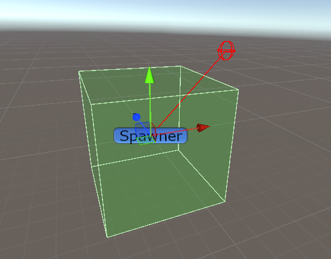
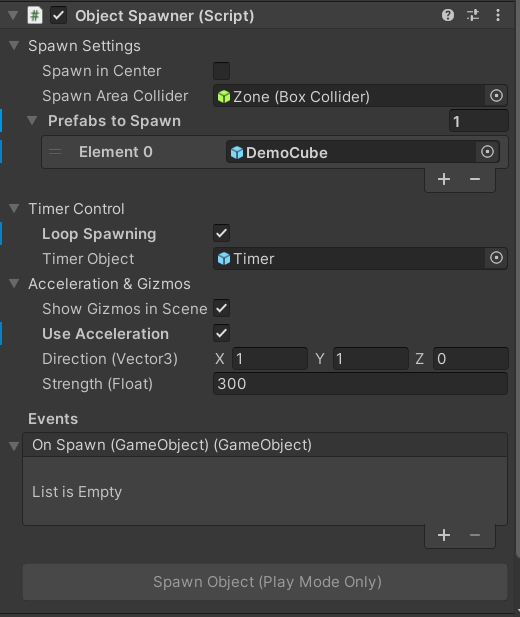
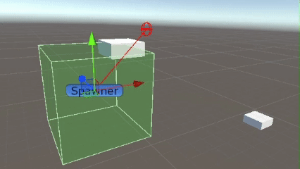
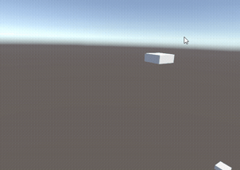

# SpawnerObjects

 

## Пример

## Как использовать?

1. Скачайте и импортируйте `SpawnerObjects.unitypackage`
2. Перетащите префаб `ObjectSpawner` на сцену
3. Настройте параметры в инспекторе

## Параметры

**Spawn Settings:**
- `Spawn in Center` — спавн в центре спавнера или в случайной точке зоны
- `Spawn Area Collider` — коллайдер зоны спавна (должен быть Trigger)
- `Prefabs to Spawn` — список префабов для спавна

**Timer Control:**
- `Loop Spawning` — циклический спавн
- `Timer Object` — объект таймера (для режима Loop)

**Acceleration & Gizmos:**
- `Show Gizmos in Scene` — визуализация зоны в сцене
- `Use Acceleration` — применить силу к объектам
- `Direction` — направление броска
- `Strength` — сила броска

## Unity Events

Доступные методы:
- `_SpawnObject()` — создать объект
- `_ClearPrefabs()` / `_AddPrefab(GameObject)` — управление списком префабов
- `_EnableLoop()` / `_DisableLoop()` / `_ToggleLoop()` — управление циклом
- `_SetAccelerationActive(bool)` / `_SetAccelerationDirection(Vector3)` / `_SetAccelerationStrength(float)` — настройка ускорения

**On Spawn** — событие вызывается после создания объекта (передает GameObject)

## Особенности

- Автоматический поиск Rigidbody (на корневом объекте или в дочерних)
- Визуализация зоны спавна (зеленый полупрозрачный куб)
- Визуализация вектора ускорения (красная линия, макс. 1 м)